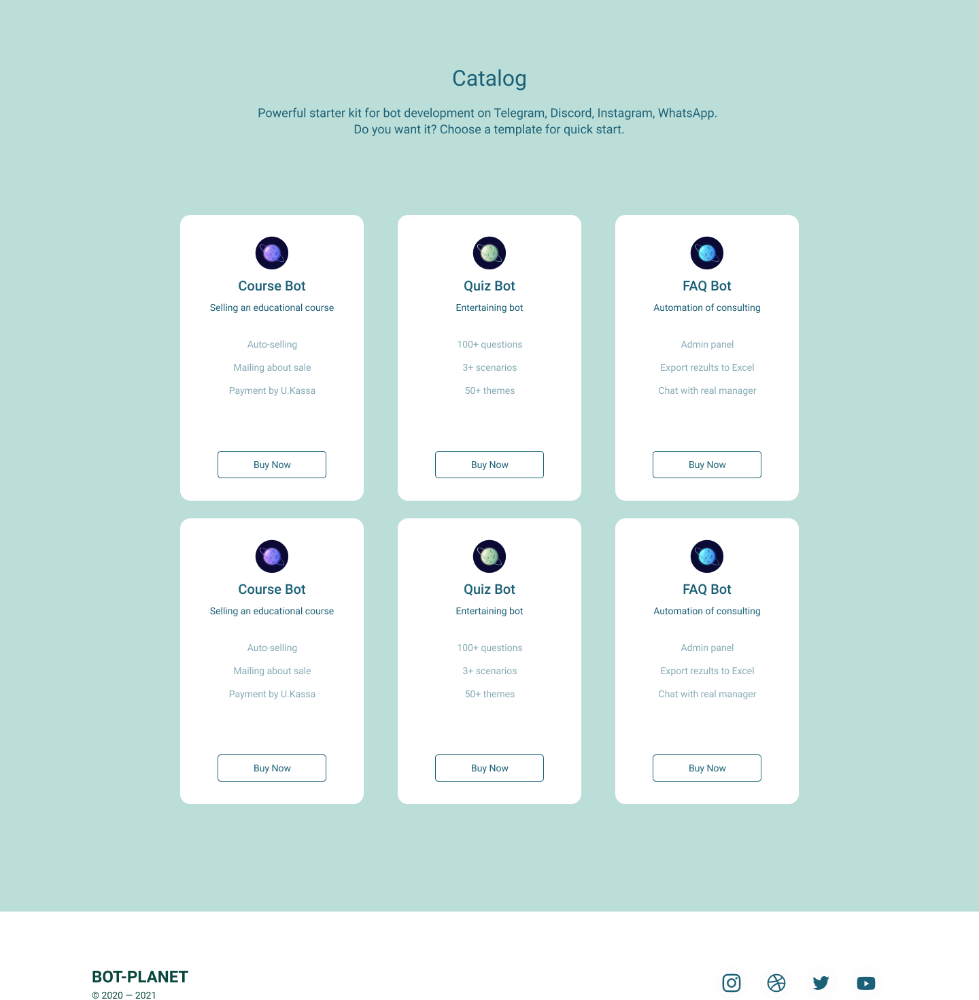
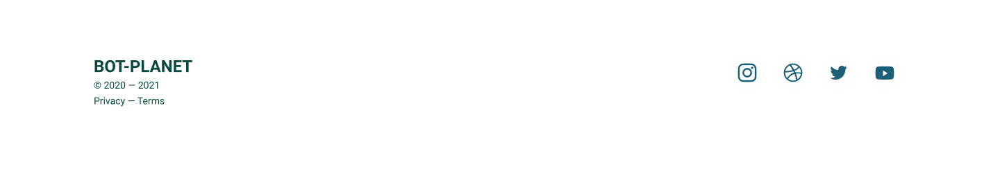
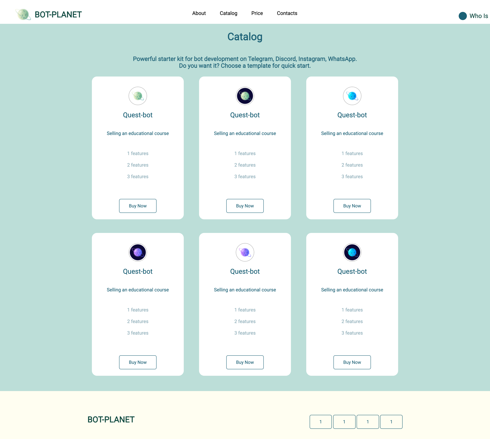

# Пример приложения по курсу Netkracker 

## Макет можно посмотреть [тут](https://www.figma.com/file/DBniZ809rIlEckjhfVW00b/HW-Netkracker?node-id=0%3A1)

## Header
- список навигации без использования Bootstrap

## Карточки
- наименование
- описвание
- кнопка для покупки

## Footer

## Кнопки со ссылками на соц.сети

# 1 итерация верстки

